# H₂H³ | Twin USB Host Switch × Triple USB Hub (with OLED Telemetry)

**H₂H³** is a compact, STM32 microcontroller-driven USB 2.0 KVM switch and 3-port hub designed to maintain a clean, clutter-free workspace in modern home offices. It enables two computers to seamlessly share a single set of peripherals—like your keyboard, mouse, and flash drives—while delivering live voltage and current telemetry via an integrated OLED display.

> [!NOTE]
> **Project Status & Contribution:** This project is actively developed. The initial commit delivers roughly 90% of the core KVM switching and telemetry functionality in a fully functional prototype stage.
>
> To bring this project to a 100% polished release, **contributions from the open-source community are highly welcome!** Whether you want to optimize edge-case handling in the C++ firmware, implement new USB HID features, or help refine the documentation—feel free to open an issue or submit a Pull Request. Let's build this together!

* **Smart Break-Before-Make Switching:** Advanced, software-controlled VBUS and data line multiplexing ensures safe, glitch-free transitions and isolated power rails between both host PCs.
* **Integrated 3-Port Hub:** Built-in Genesys Logic controller expands a single shared USB connection into three downstream ports for your everyday desk peripherals.
* **🚀 Native Host-MCU Communication (Endless Use Cases!):** Unlike dumb KVM switches, the onboard STM32 MCU is wired directly into the hub as a **fourth USB peripheral device**. This allows the MCU to communicate natively with the active Host PC—opening up vast possibilities for custom PC desktop apps, background telemetry logging, hardware automation scripts, or even full USB HID keyboard/mouse emulation.
* **Live Telemetry Dashboard:** A crisp, integrated 64x32 pixel OLED display provides real-time insights by showing live bus voltage and precise current draw per port.
* **Ergonomic & Screw-less Enclosure:** Features a clean interface with a discreetly placed rear tactile button to prevent cable snags, all housed in a robust, snap-fit PA12-HP Nylon shell optimized for MJF 3D printing.
* **Modern C++ Firmware:** Driven by a powerful STM32G0 architecture running a modular, object-oriented C++ firmware stack with hardware-level overcurrent protection.

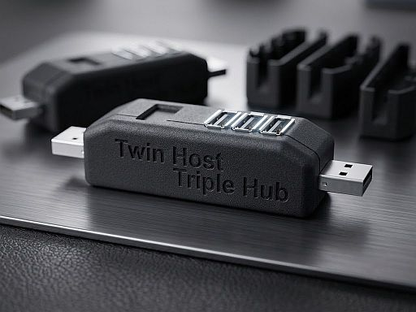

Jump straight to the [📸 Photo Gallery](#-photo-gallery).

## 🔭 Background & Philosophy

H₂H³ represents a personal exploration into modern decentralized manufacturing and open-source engineering. It blends professional design principles with modern open-source software, AI-collaborative programming to refine the C++ firmware, and on-demand fabrication. The fact that an individual engineer can now prototype industrial-grade hardware using low-volume far-east manufacturing is nothing short of incredible.

To give back to the community, the full design files—spanning schematics, mechanics, and source code—are public domain under MIT and CERN Open Hardware licenses. It is intended strictly for educational use, and community-driven remixes are highly encouraged.

## 🛠️ Design Stack & Toolchain

The hardware, enclosure, and software for H₂H³ were designed using the following tools:

* **KiCad 9.0:** Schematic entry and PCB design for the 4-layer board.
* **FreeCAD 1.0:** 3D modeling of the screw-less, snap-fit two-part enclosure.
* **Firmware Toolchain:** Developed in modern modular C++ utilizing **STM32CubeMX** for hardware abstraction. Out of the box, the repository supports a dual-development workflow—you can build and debug the firmware seamlessly using either **Visual Studio Code (via CMake/Ninja)** or **STM32CubeIDE**, depending on your preferred environment.

---

## 🛠️ Hardware Specification


* **Microcontroller:** ARM Cortex-M0+ 32-bit MCU (STM32G0B1KBU6, 64 MHz, 128 KB Flash, 144 KB RAM), integrated as a 4th peripheral on the hub.
* **USB 2.0 Hub Controller:** Genesys Logic GL852G.
* **Physical Interface:** * 2x USB-A Male (Host 1 / Host 2 connections)
  * 3x USB-A Female (Peripheral downstream ports)
* **Telemetry Sensors:** Continuous dual-host VBUS voltage sensing (enables auto-detection) and triple-peripheral current monitoring.
* **Switching Architecture:** Hybrid automatic/software-controlled VBUS muxer combined with hardware USB data line multiplexers.
* **User Interface:** 64x32 pixel OLED screen, 1x rear tactile switch button, and 1x fully programmable RGB LED (color and brightness).
* **Form Factor:** Ultra-compact desktop footprint (approx. 60 × 20 × 20 mm).

---

## 💻 Software & Firmware Architecture

The firmware is built using **STM32CubeMX** for hardware abstraction and written in **C/C++**.

### Advanced Features

* **Fully Modularized C/C++:** Source code is designed fully modular in C++ with support from the HAL in C automatically created by STM32CubeMX.
* **Optimized ADC Sampling:** Continuous monitoring of port power states with software-side calibration.
* **Overcurrent Detection:** Peripheral current draw of more than 1.5 A enters fault mode which the device resumes from by user confirmation.
* **UART Debug Console:** Retargeted `printf` over the STM32 USART2 or USB virtual COM port.
* **Binary Programming:** Powering on and holding switch button simultaneously enters the programming mode (STM32CubeProgrammer) which enables programming the ST32 integrated flash without the need for a hardware debugger

---

## 📂 Repository Structure

```text
twinusb/
├── assets/                  # Public media & documentation images
├── enclosure/               # Mechanical 3D CAD design (FreeCAD)
├── firmware/                # Production-ready STM32G0 C/C++ firmware
│   ├── App/                 # Core Application Logic (C++)
│   │   ├── Inc/             # Application Managers (Hub, Display, Sensors, UI)
│   │   └── Src/             # Implementation source code
│   ├── Core/                # Hardware peripheral initialization (ADC, I2C, GPIO)
│   ├── cmake/               # Toolchain configuration profiles
│   ├── Libs/                # Embedded drivers & hardware abstraction libraries
│   │   └── oled_waveshare/  # Low-level 0.49" 64x32 OLED display driver components
│   ├── Middlewares/         # STMicroelectronics USB Device Library stack
│   ├── Startup/             # Microcontroller boot vector assembly code
│   └── USB_Device/          # USB CDC Class configuration and descriptor maps
└── hardware/                # Electronics engineering files (KiCad)
    ├── lib_fp/              # Custom PCB footprint libraries (.pretty)
    └── lib_sch/             # Custom schematic component symbols
```

---

## ⚡ Getting Started & Building the Firmware

### 1. Cloning the Repository

```bash
git clone https://github.com/s-t-e-f-a-n/twinusb.git
cd twinusb

```

This project supports a **dual-development workflow**. You can build the firmware using either **VS Code (via CMake)** or the official **STM32CubeIDE**. Choose the workflow that best fits your environment. You do not need to use STM32CubeMX to build the project from scratch.

---

### Method A: Building with VS Code (Recommended)

This method uses CMake and Ninja/Make. It requires a local ARM GCC toolchain installed on your system.

#### Prerequisites

Ensure you have the following installed and available in your system's `PATH`:

* **ARM GNU Toolchain:** `arm-none-eabi-gcc`
* **Build Tools:** `CMake` and `Ninja` (or `Make`)
* **VS Code Extensions:**
* [CMake Tools](https://marketplace.visualstudio.com/items?itemName=ms-vscode.cmake-tools)
* [C/C++ Extension Pack](https://marketplace.visualstudio.com/items?itemName=ms-vscode.cpptools-extension-pack)

#### VS Code Setup & Build Steps

1. **Open Project:** Open the `firmware` directory in VS Code.
2. **Select Compiler Kit:** Open the Command Palette (`Ctrl+Shift+P` / `Cmd+Shift+P`), search for **`CMake: Select a Kit`**, and select your installed `arm-none-eabi` compiler.
3. **Select Build Variant:** Choose either `Debug` or `Release` from the CMake status bar at the bottom.
4. **Configure Project:** Run **`CMake: Configure`** from the Command Palette. This will clean-room generate your local `build/` directory with the correct absolute paths for your machine.
5. **Compile:** Click **`Build`** in the status bar or press `F7`.

---

### Method B: Building with STM32CubeIDE

STM32CubeIDE is an all-in-one Eclipse-based IDE that includes its own compiler toolchain and internal build system out of the box.

#### STM32CubeIDE Setup & Build Steps

1. **Import Project:**

* Open STM32CubeIDE.
* Go to `File` ➔ `Open Projects from Filesystem...`
* Select `Directory` ➔ `Choose twinusb folder` and click *Select Folder*.
* Click *Finish*.

2. **Index Project:** Wait a few moments for the IDE to finish indexing the source files.

3. **Compile:** Click the **Hammer icon (Build)** in the top toolbar, or press `Ctrl+B` (`Cmd+B` on macOS).

---

### ⚠️ Crucial Note on Code Generation (C++ Integration)

The core application logic of this project is written in modern **C++** and lives inside the `App/` directory (`App/Src` and `App/Inc`), keeping it cleanly decoupled from the autogenerated ST HAL layer.

If you decide to open the `twinusb.stm32.ioc` file to modify pinouts or peripherals via STM32CubeMX and click **"Generate Code"**, the tools will reset the project workspace to ST's default pure-C template.

**If your IDE loses track of the C++ files after code generation, fix it manually:**

* **In STM32CubeIDE:** Right-click the project ➔ `Properties` ➔ `C/C++ General` ➔ `Paths and Symbols`.
* Under **Includes**, re-add the `App/Inc` directory.
* Under **Source Location**, re-add the `App/Src` directory.

* **In VS Code:** Simply run **`CMake: Delete Cache and Reconfigure`** from the Command Palette to force CMake to re-scan the file structure.

---

## 🏭 Sourcing the Hardware

### PCB & Assembly

The schematics and PCB layout are located in the `/hardware` folder, designed in KiCad and optimized for automated assembly (PCBA) via services like JLCPCB.

### Enclosure

Print the shell components located in the `/enclosure` folder. Nylon (SLS/MJF technique) is highly recommended for that professional, textured matte finish and mechanical durability.

---

Let me know if you are interested in the fabrication of the design.

---

## 📸 Photo Gallery

| &nbsp; | &nbsp; | &nbsp; |
| :---: | :---: | :---: |
| 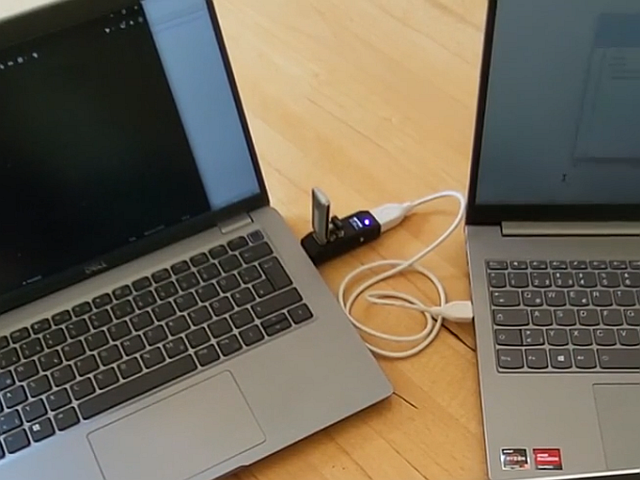 | 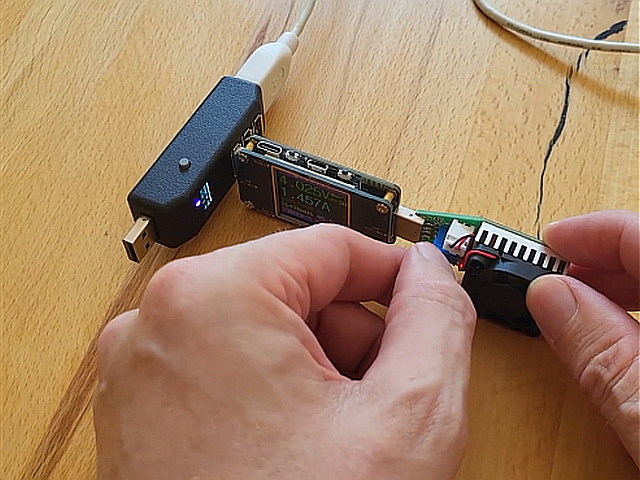 | 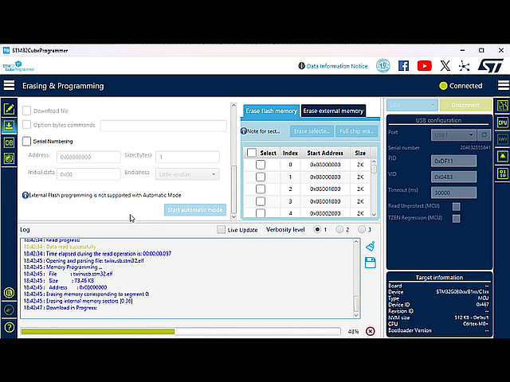 |
| 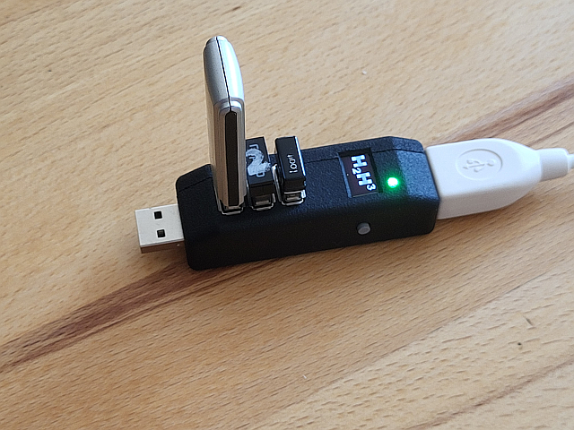 |  | 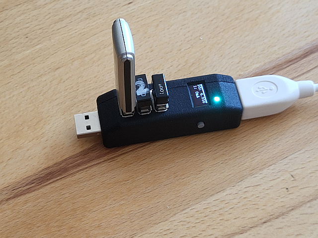 |
| 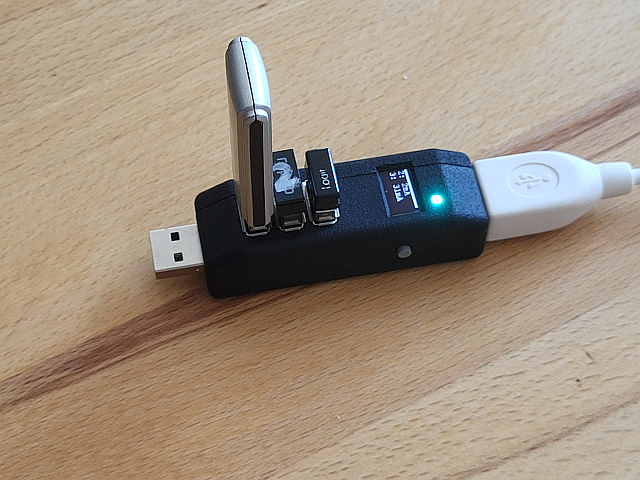 | 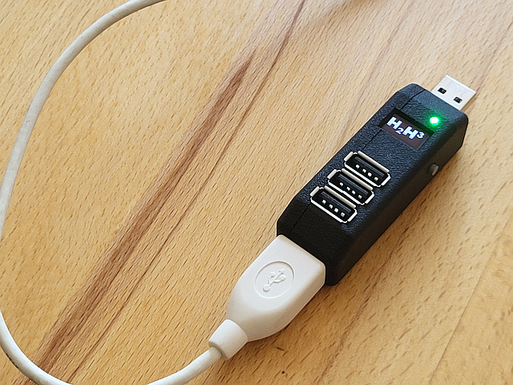 |  |
| 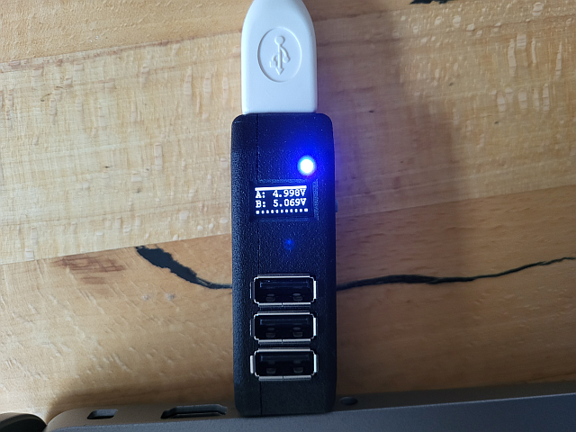 | 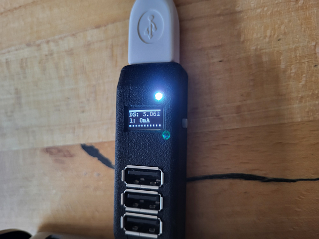 | 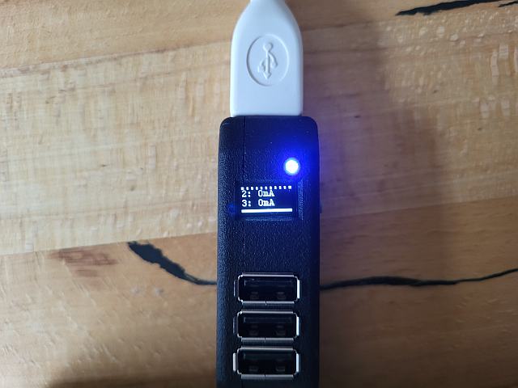 |
| 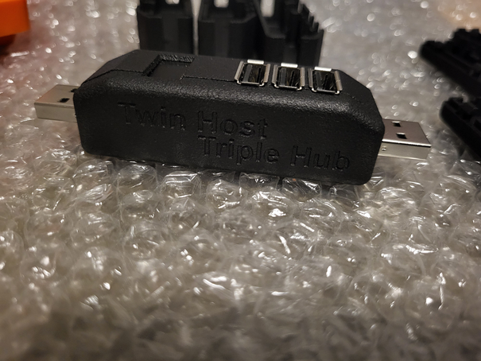 | 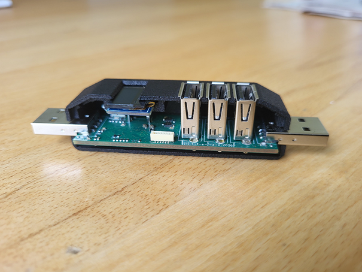 | 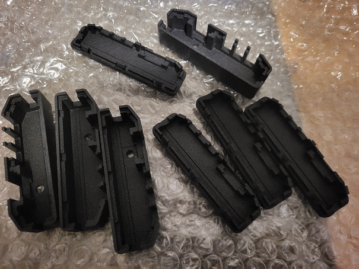 |
| 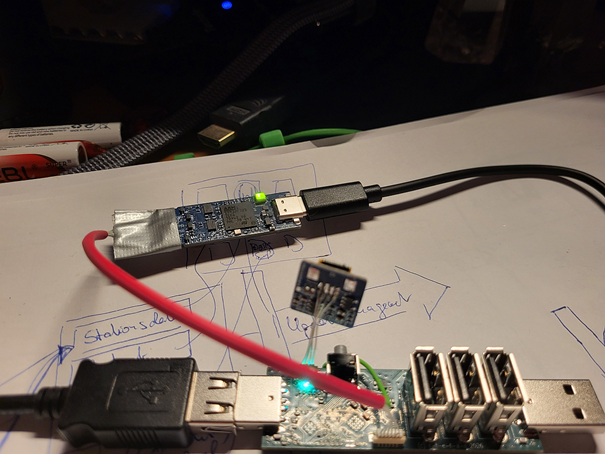 | 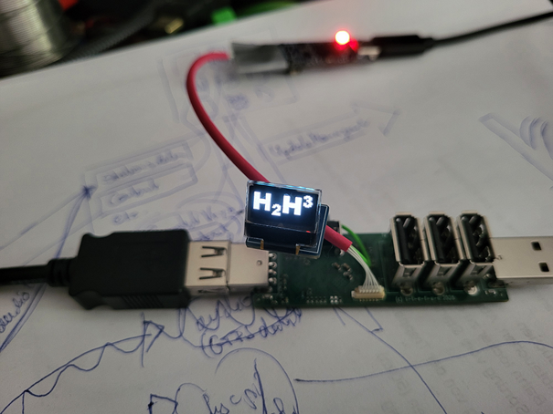 | 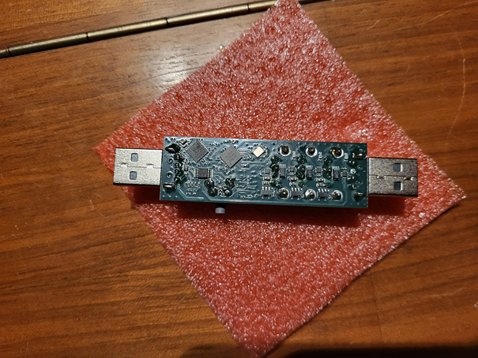 |
| 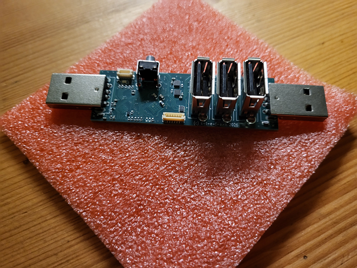 | 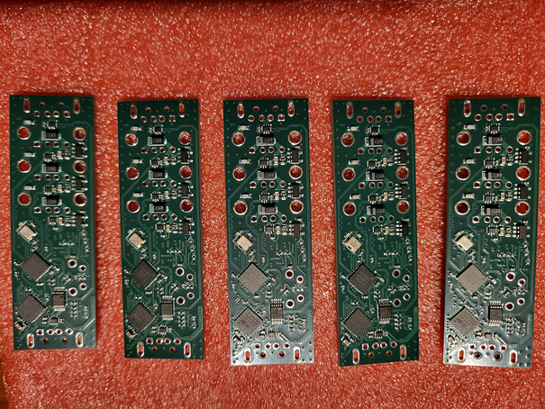 | 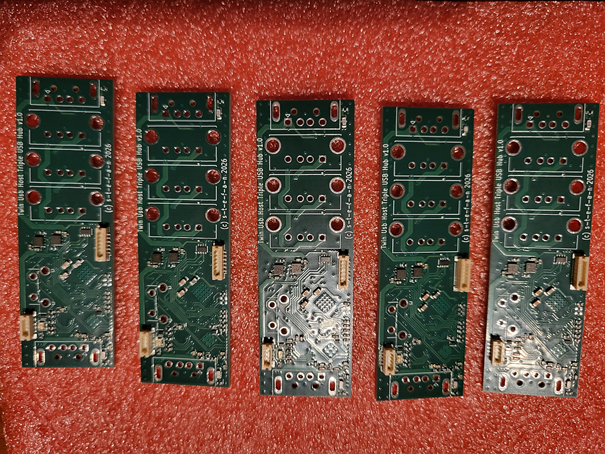 |

---

## ⚖️ License

This project is licensed under different Open Source licenses depending on the component:

* 💻 **Firmware & Software:** Licensed under the [MIT License](firmware/LICENSE)
  *(Permissive, commercial-friendly software license)*
* 🔌 **Hardware (PCB & Schematics):** Licensed under the [CERN-OHL-W v2](hardware/LICENSE)
  *(CERN Open Hardware Licence - Weak Copyleft)*
* 📦 **Enclosure (Mechanical CAD):** Licensed under the [CERN-OHL-W v2](enclosure/LICENSE)
  *(CERN Open Hardware Licence - Weak Copyleft)*

All components are copyrighted © 2026 by **s-t-e-f-a-n** who developed them with ❤️
